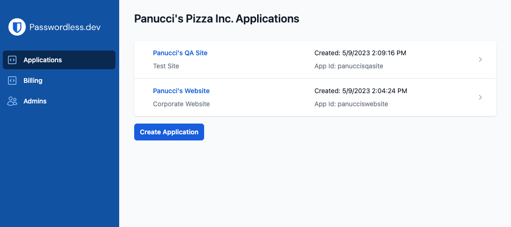
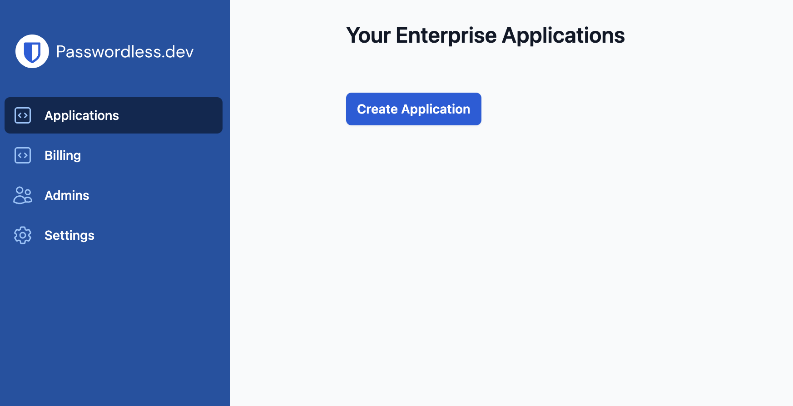
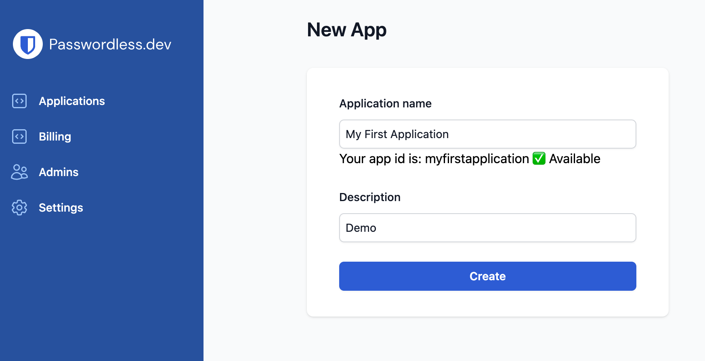
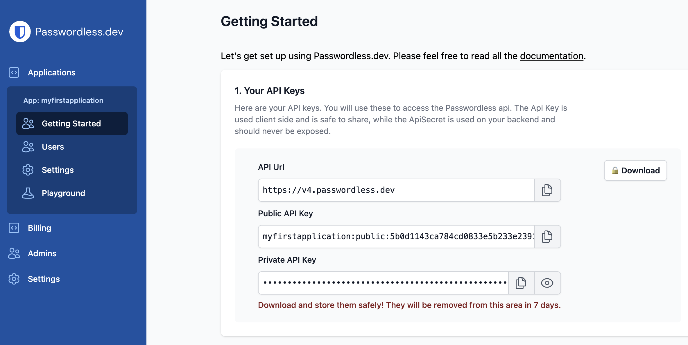
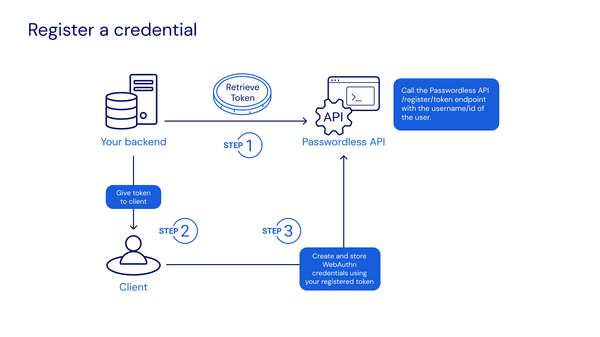
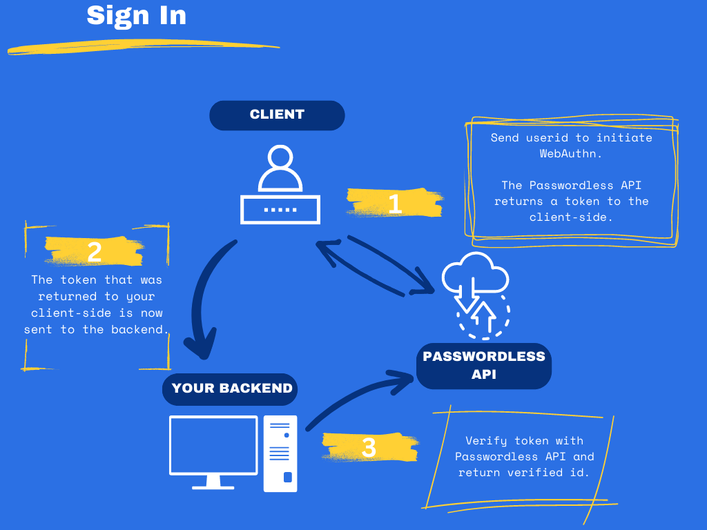

# Get Started

Passwordless.dev is a software toolkit that empowers web developers to build applications that easily authenticate end-users using [FIDO2 WebAuthn passkeys](concepts). In this guide, we'll chart the quickest path to implementing Passwordless.dev for your website.

::: tip
This guide will skip over some conceptual basics in order to get you started as quickly as possible. Check out [Concepts](concepts) for in-depth discussion of the ideas used by Passwordless.dev.
:::

In this guide we'll provide JavaScript examples, however you can check out sample code, guidelines, and tips for other toolkits in [Backend Language Examples](backend) and [Frontend Framework Examples](frontend).

## Sign up

[Sign up](https://admin.passwordless.dev/signup) for a free Passwordless.dev account. Bitwarden offers a free Passwordless.dev account, or [paid plans](https://bitwarden.com/products/passwordless/#pricing) that unlock certain tiers of usage and features.

When you sign up you'll land on the [admin console](admin-console), your primary GUI for creating and configuring applications, monitoring application usage, and managing billing:
</br>
</br>

</br>
</br>

## Create an application

Select the **Create Application** button and give your new application an **Application name** and **Description**. For each application, a set of [API keys](concepts.html#api-keys) will be generated. You'll use these API keys for authentication with the Passwordless.dev API. Save your public key and private secret somewhere safe, like [Bitwarden Secrets Manager](https://bitwarden.com/help/secrets-manager-overview).







:::warning
It's important to download your API keys to a safe place, as they will be removed from the admin console after 7 days.
:::

## Install the library

Next, install the [Passwordless.dev JavaScript client library](js-client), either globally or as a module within your application. This library will allow your application to interact with the Passwordless.dev API and with browsers' WebAuthn API. To install the library:


<CodeSwitcher :languages="{bash1:'yarn',bash2:'npm',es6:'ES6',html:'html'}">
<template v-slot:bash1>

```bash
yarn add @passwordlessdev/passwordless-client
```
In all cases, your frontend must import the library to call the methods used by Passwordless.dev:
```js
import { Client } from '@passwordlessdev/passwordless-client';
```
</template>
<template v-slot:bash2>

```bash
npm install @passwordlessdev/passwordless-client
```
In all cases, your frontend must import the library to call the methods used by Passwordless.dev:
```js
import { Client } from '@passwordlessdev/passwordless-client';
```
</template>
<template v-slot:es6>

```html
<script src="https://cdn.passwordless.dev/dist/1.1.0/esm/passwordless.min.mjs" crossorigin="anonymous"></script>
```
In all cases, your frontend must import the library to call the methods used by Passwordless.dev:
```html
<script type="module">
    import { Client } from "https://cdn.passwordless.dev/dist/1.1.0/esm/passwordless.min.mjs"
</script>
```
</template>
<template v-slot:html>

```html
<script src="https://cdn.passwordless.dev/dist/1.1.0/umd/passwordless.umd.min.js" crossorigin="anonymous"></script>
```
In all cases, your frontend must import the library to call the methods used by Passwordless.dev:
```html
<script>
const Client = Passwordless.Client;
const p = new Client({});
</script>
```

</template>
</CodeSwitcher>

## Build a registration flow

Next, implement a workflow on your backend and frontend for registering a [passkey](concepts.html#passkey). At a high-level, here's what you'll be doing:
</br>
</br>

</br>
</br>
Let's break down these steps:

1. On your backend, generate a [registration token](api#register-token) by calling the passwordless.dev API's `/register/token` endpoint ([What is a token?](concepts/#tokens)). While you can send in a number of options, the minimum arguments are `userId` and `username`, for example:

<Badge text="backend" type="warning"/>

```js

// Node.js - Code written for this step should run on your backend.

const payload = {
  "userId": "107fb578-9559-4540-a0e2-f82ad78852f7", // Required. A WebAuthn User Handle, which should be generated by your application. Max. 64 bytes.
  "username": "pjfry@passwordless.dev", // Required. A human readable username used for user authentication, should be chosen by the user.
  // ...For more options, please see the API reference for /register/token.
};

// POST the payload to the Passwordless.dev API using your API private secret.
const apiUrl = "https://v4.passwordless.dev";
const {token} = await fetch(apiUrl + "/register/token", {
    method: "POST",
    body: JSON.stringify(payload),
    headers: {
        "ApiSecret": "myapplication:secret:11f8dd7733744f2596f2a28544b5fbc4",
        "Content-Type": "application/json"
    }
}).then(r => r.json());
```

Successful implementation will create a registration token returned that is returned as a string, for example:

```json
{ "token": "register_wWdDh02ItIvnCKT_02ItIvn..." }
```

::: tip
Should your API request fail, you will receive a error response with `json`-formatted [problem details](errors).
:::

2. On your frontend, initiate the WebAuthn process to create and store a passkey using the generated registration token ([learn more](js-client)), for example:

<Badge text="frontend" type="tip"/>

```js
// Code written for this step should run on your frontend.
import {Client} from "@passwordlessdev/passwordless-client";

// Instantiate a passwordless client using your API public key.
const p = new Client({
    apiKey: "myapplication:public:4364b1a49a404b38b843fe3697b803c8"
});

// Fetch the returned registration token from the backend.
const backendUrl = "https://localhost:7002"; // Your backend.
const registerToken = await fetch(backendUrl + "/create-user").then(r => r.json());

// Register the token with the end-user's device.
const {token, error} = await p.register(registerToken);
if(token) {
    // Successfully registered!
} else {
    console.error(error);
}
```

Successful implementation will prompt Passwordless.dev to negotiate creation of a passkey through the user's web browser API and save its public key to the database for future sign-in operations.

## Build a signin flow

Next, implement a workflow on your backend and frontend for signing in with a [passkey](concepts.html#passkey). At a high-level, here's what you'll be doing:
</br>
</br>

</br>
</br>
Code that you write must:

1. On your frontend, initiate your sign-in and retrieve a [verification token](concepts.html#tokens) that will be checked by your backend to complete a sign-in. To initiate the sign-in, you can use an alias, userId, or Discoverable Credential  ([learn more](js-client.html#signin)), for example:

<Badge text="frontend" type="tip"/>

```js
// Code written for this step should run on your frontend.

// Instantiate a passwordless client using your API public key.
const p = new Client({
    apiKey: "myapplication:public:4364b1a49a404b38b843fe3697b803c8"
});

// Allow the user to specify a username or alias.
const alias = "pjfry@passwordless.dev";

// Generate a verification token for the user.
const {token, error} = await p.signinWithAlias(alias);
// Tip: You can also try p.signinWithDiscoverable();

// Call your backend to verify the generated token.
const backendUrl = "https://localhost:7002"; // Your backend.
const verifiedUser = await fetch(backendUrl + "/signin?token=" + token).then(r => r.json());
if(verifiedUser.success === true) {
  // If successful, proceed!
}
```

Successful implementation will make a verification token available to the backend. In the above example, the client waits for the backend to return `true` (**step 2**) before proceeding to act on the confirmed sign-in.

2. Validate the verification token by calling the Passwordless.dev API's `/signin/verify` endpoint ([learn more](api.html/#signin-verify)) with generated token, for example:

<Badge text="backend" type="warning"/>

```js
// Code written for this step should run on your backend.

// Fetch the verification token from your frontend.
const token = { token: req.query.token };

// POST the verification token to the Passwordless.dev API using your API private secret.
const apiUrl = "https://v4.passwordless.dev";
const response = await fetch(apiurl + "/signin/verify", {
    method: "POST",
    body: JSON.stringify({token}),
    headers: { "ApiSecret": "myapplication:secret:11f8dd7733744f2596f2a28544b5fbc4", "Content-Type": "application/json" }
});

// Cache the API response (see below) to a variable.
const body = await response.json();

// Check the API response for successful verification.
// To see all properties returned by this endpoint, checkout the Backend API Reference for /signin/verify.
if (body.success) {
    console.log("Successfully verified sign-in for user.", body);
    // Set a cookie/userid.
} else {
    console.warn("Sign in failed.", body);
}
```

Successful implementation of the above `POST` will return a success response including the user's `userId`, for example:

```json
{
  "success": true,
  "userId": "123",
  "timestamp": "2021-08-01T01:33:36.9773187Z",
  "rpid": "example.com",
  "origin": "http://example.com:3000",
  "device": "Chrome, Windows 10",
  "country": "",
  "nickname": "Home laptop",
  "credentialId": "Mq1ZhrHBmhly34YaO/uuXuNuf/VCHDkuknENz/LZJR4=",
  "expiresAt": "2021-08-01T01:35:36.9773193Z"
}
```

Use the `.success` value (`true` or `false`) to determine next actions, i.e. whether to complete the sign-in (**step 1**) by, for example, setting a cookie.

## Next steps

Congratulations on mastering a basic implementation of Passwordless.dev! Next:

- Check out other [Backend Languages](backend) and [Frontend Frameworks](frontend) to find the best fit for your application.
- Dig into the functionality offered by the [Admin Console](admin-console).
- Figure out the [best plan](https://bitwarden.com/pricing/passwordless/) to fit the needs of your application or business.
